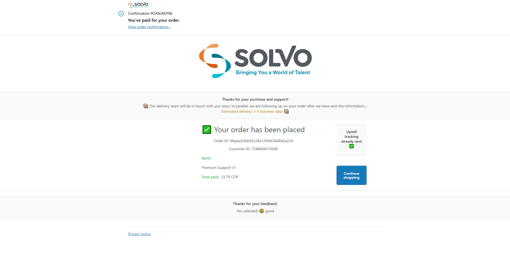
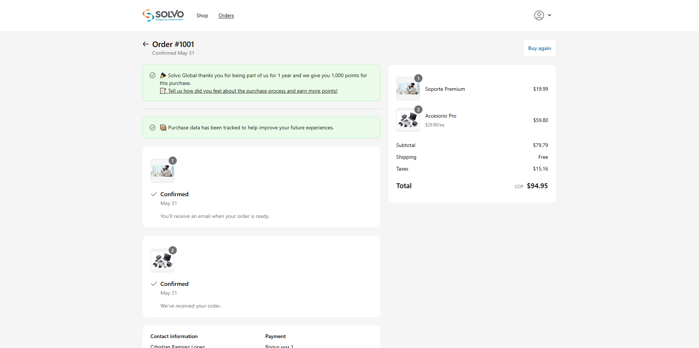
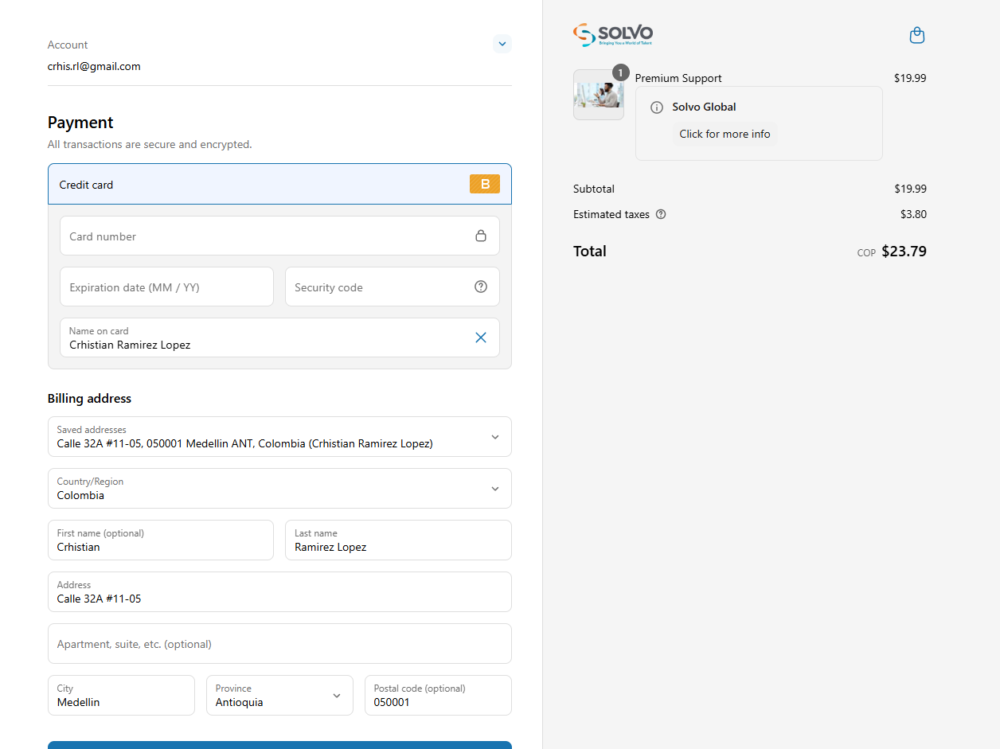

# Solvo Global Shopify Extension Suite 🛍️

This monorepo contains the **complete migration and enhancement** of legacy tracking and UI logic from the Shopify Order Status Page and Post Purchase Page to modern Checkout Extensibility extensions using React + TypeScript.

> 🧪 Built as a technical challenge for **Solvo Global**.

---

## 📂 Extensions Overview

This repository includes **three Shopify UI extensions**, each one fully modularized and ready for deployment:

| Extension                | Target Location           | Purpose                                                              |
| ------------------------ | ------------------------- | -------------------------------------------------------------------- |
| `solvo-ext-checkout`     | Checkout & Thank You Page | Display custom product info via metafields                           |
| `solvo-ext-orderstatus`  | Order Status Page         | Simulate tracking (cookies, AJAX) and show user feedback UI          |
| `solvo-ext-postpurchase` | Post Purchase Page        | Simulate upsell tracking, branding, order details, and feedback form |

---

## 📸 Screenshots & Demos

-- Post Purchase --



-- Order Status --



-- Checkout --



---

## 🛠️ Installation

```bash
git clone https://example.com/solvo-test (replace with repo URL)
cd solvo-test
npm install
npm run dev o shopify app dev
```

Make sure you have:

- Shopify CLI (logged in via `shopify login` command)
- Store with Checkout Extensibility enabled
- Store connected to the app via Shopify CLI

## Note: For this project the used store is `https://prueba-solvo.myshopify.com/` and the password is `solvoglobal`.

## 📁 Project Structure

```
solvo-test/
│
├── extensions/
│   └── solvo-ext-checkout/
│   └── solvo-ext-orderstatus/
│   └── solvo-ext-postpurchase/
└── README.md ← (this file)
```

Each folder includes its own extension logic, following a modular architecture with:

- `components/`
- `services/`
- `utils/`
- `types/`
- `constants/`

---

## 🚀 Features

### ✅ Migrated Logic

| Legacy Code                   | New Implementation                                      | Location                     |
| ----------------------------- | ------------------------------------------------------- | ---------------------------- |
| `getAppConvCookie()`          | `utils/cookies.ts`                                      | All extensions               |
| `cyrb53()` Hashing            | `utils/hash.ts`                                         | Order Status & Post Purchase |
| AJAX to example.com/i/        | `services/tracking.ts` / `simulateUpsell.ts`            | Order Status & Post Purchase |
| `gtag` and `dataLayer.push()` | Simulated via `console.log()`                           | Order Status & Post Purchase |
| Inline banners/messages       | Modular UI components (`Banner`, `CalloutBanner`, etc.) | All                          |

---

## 📘 Developer Notes

- The `mockCheckout` object simulates real checkout data, as Shopify hasn’t yet exposed full checkout context in Order Status extensions.
- `fetchProductMetafield()` queries custom metafields to display relevant info per product.
- The code is cleanly structured, typed (`TypeScript`), and ready for CI/CD pipelines or production deployment.

---

## 📩 Submission Instructions

This repository is the full technical solution for the challenge issued by Solvo Global. Please visit the `README.md` in each extension folder for specific implementation details.

---

## 🤝 Author

Developed by **Crhistian Ramírez López**  
Email: crhis.rl@gmail.com  
GitHub: [CrhissJS](https://github.com/CrhissJS)
