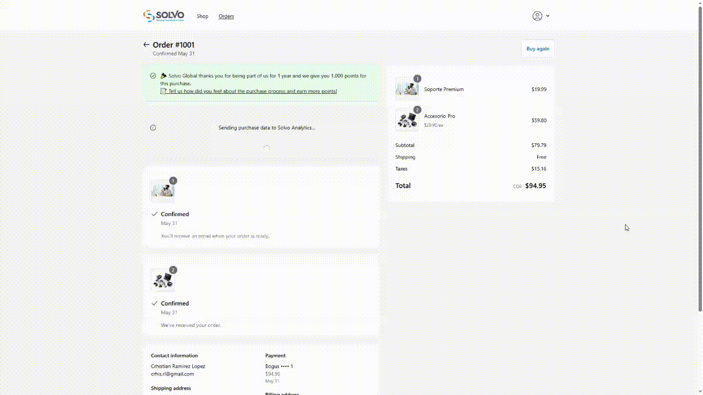

# Order Status Extension

This extension replaces legacy `Order Status Page` logic with a **modern, modular, and trackable** alternative.

---

## 🎯 Use Case

Historically, inline scripts (`oh_conversion.js`, `gtag`, cookies, etc.) were previously included within Liquid themes. This extension **migrates that logic** cleanly.

## ✨ Features

- `OrderStatusBanner`: Order view with two banners above the order's products information
- `TrackingRequest`: Track order data through cookies and send that data to Analytics

---

## 🔁 Migrated Features

| Legacy Code                   | Modern Implementation      |
| ----------------------------- | -------------------------- |
| `oh_conversion.js`            | `services/tracking.ts`     |
| `getAppConvCookie()`          | `utils/cookies.ts`         |
| `cyrb53()`                    | `utils/hash.ts`            |
| `gtag` and `dataLayer.push()` | `console.log()` simulation |
| Success message               | UI banner with loader      |

---

## 🖼️ Visual Demo

-- Order Status Page displaying two banner messages --



---

## ⚙️ Folder Structure

```
solvo-ext-orderstatus/src/
├── components/
│   ├── OrderStatusBanner.tsx
│   └── TrackingRequest.tsx
├── services/
│   └── tracking.ts
├── utils/
│   ├── cookies.ts
│   └── hash.ts
├── types/
│   └── index.ts
├── constants/
│   └── index.ts
└── OrderStatusBlock.tsx
```

## 🔍 Tracking Simulation (Order Status Page)

The extension simulates Shopify tracking logic by reading legacy cookies and sending analytics requests. The result is logged in the console for developers. Here's an example output:


This screenshot shows the successful simulation of purchase tracking data from the Order Status Page. It includes:

- Simulated cookie access in restricted environments
- A simulated dataLayer push
- gtag conversion emulation
- Enhanced conversion data (first name, last name, billing address, etc.)
- A failed fetch() request due to CORS policy, which is expected in development environments using dummy endpoints.

---

## 🧠 Notes

- Tracking calls are simulated (no real network) due to limitations
- Mock checkout is used until Shopify exposes order data in this context
