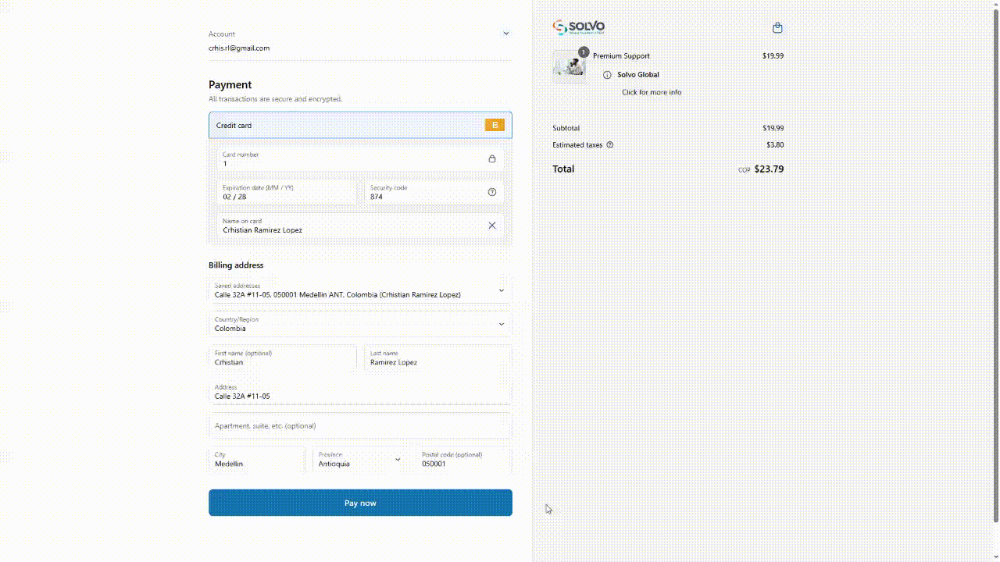

# Post Purchase Extension

This extension enhances the post-purchase experience with:

- 🧾 Order summary
- 📦 Upsell tracking simulation
- ✅ Feedback collection
- 🖼️ Brand presence

---

## 🎯 Use Case

Historically, inline scripts (`oh_conversion.js`, `gtag`, cookies, etc.) were previously included within Liquid themes. This extension **migrates that logic** cleanly.

## ✨ Features

- `OrderDetails`: Clean view of purchased items
- `TrackingRequest`: Sends product-based tracking via cookies
- `SatisfactionForm`: Gathers customer sentiment
- `SolvoLogo`: Company branding at the top

---

## 🔁 Migrated Features (Post Purchase)

| Legacy Code                          | Modern Implementation                  |
| ------------------------------------ | -------------------------------------- |
| `oh_conversion.js` (upsell part)     | `utils/simulateUpsell.ts`              |
| `getAppConvCookie()`                 | `utils/cookies.ts`                     |
| Tracking request by `XMLHttpRequest` | `simulateUpsellTracking()` con logs    |
| Success tracking confirmation        | `Button` + `CalloutBanner` visual      |
| Enhanced event info                  | `utils/tracking.ts` con logs simulados |
| Tracking init trigger                | `TrackingRequest` auto on mount        |
| Manual resend upsell tracking        | `Send Upsell Tracking` button          |

---

## 🖼️ Visual Demo

-- Post Purchase Page displaying an UI with migrated features and brand presence --



---

## ⚙️ Folder Structure

```
solvo-ext-postpurchase/src/
├── components/
│   ├── OrderDetails.tsx
│   ├── SatisfactionForm.tsx
│   ├── SolvoLogo.tsx
│   └── TrackingRequest.tsx
├── services/
│   └── handleTracking.ts
├── utils/
│   ├── cookies.ts
│   ├── simulateUpsell.ts
│   └── tracking.ts
├── constants/
│   └── index.ts
├── types/
│   └── order.ts
└── index.tsx
```

---

## 📊 Tracking Behavior

All events simulate requests to:

```
https://example.com/i/1/d/ftd?...params
```

They read the cookie `oh_click`, apply a hashed order ID, and simulate the tracking request with AJAX via `XMLHttpRequest`.

## 📦 Post Purchase Tracking Logs

This post purchase extension also simulates upsell product tracking. Here's a snapshot of the console:


This console log represents simulated upsell tracking triggered by the Post Purchase UI Extension. It logs:

- Customer and order IDs
- Tracking payload metadata
- A failed XMLHttpRequest due to CORS (as expected with placeholder URLs)
- Confirmation message that tracking was simulated for dummy upsell product.

---

## 💡 Notes

- ⚠️ Due to current Shopify Checkout Extensibility limitations, Post Purchase UI Extensions do not support programmatic navigation to the Thank You Page. After finishing the post-purchase experience, users must close the window or wait for the automatic redirect handled by Shopify. We simulate this exit with a user-facing message and internal flag.

- Button `Send Upsell Tracking` sends another request per item
- Feedback is saved to storage
- “Continue Shopping” button finishes the extension
